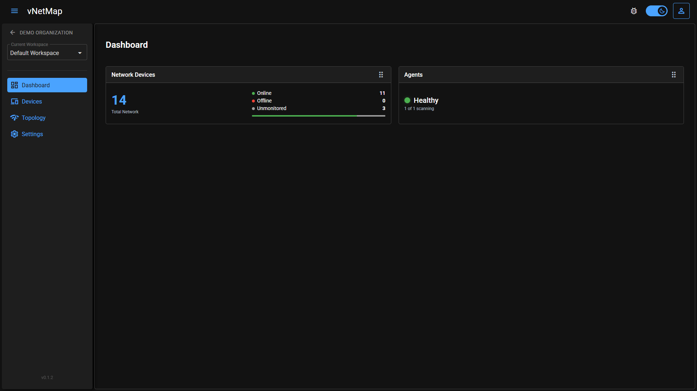
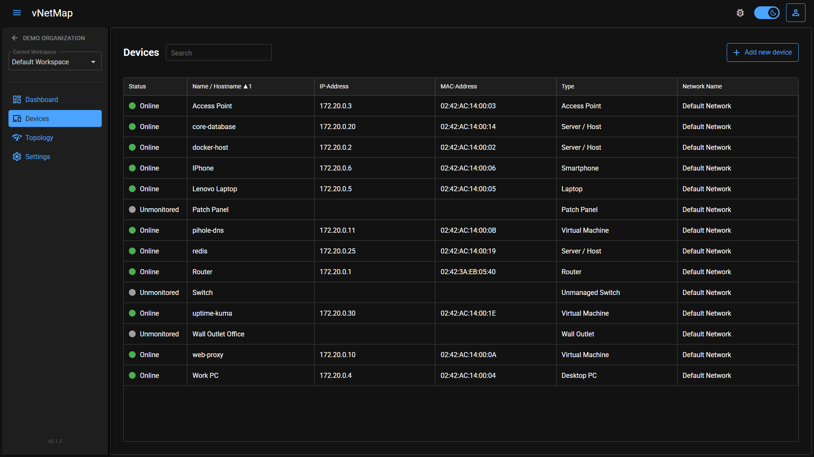
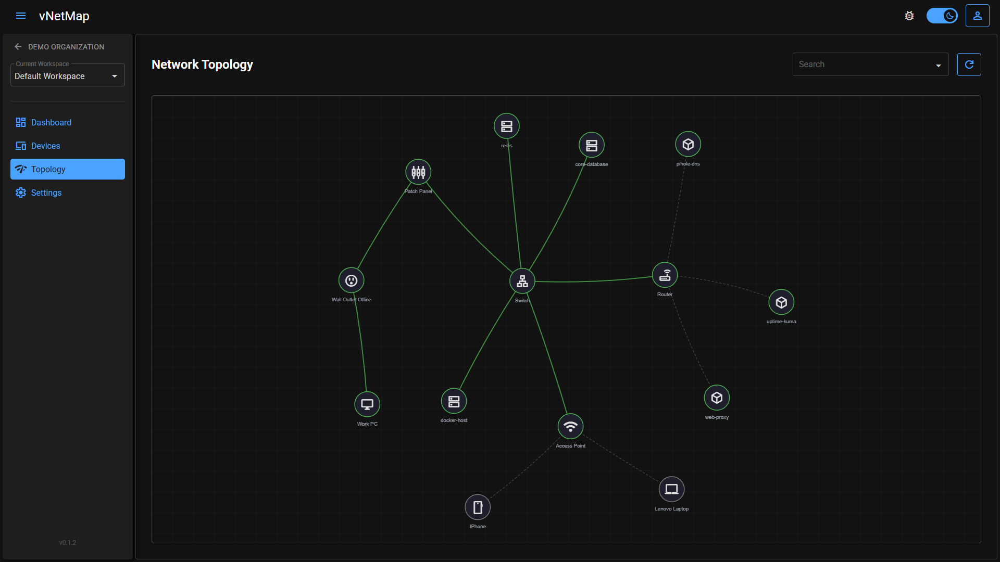
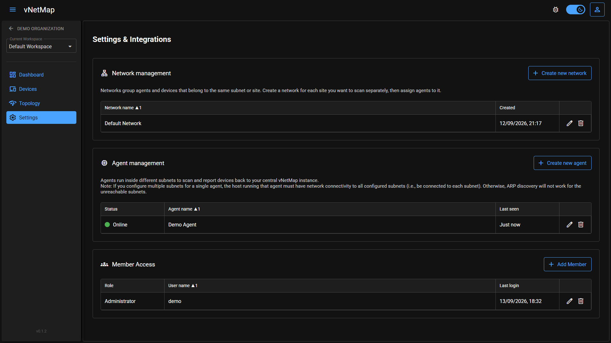

# vNetMap - Zero-Knowledge Network Visualization

<table>
  <tr>
    <td style="border: none">
      
    </td>
    <td style="border: none">
      
    </td>
  </tr>
  <tr>
    <td style="border: none">
      
    </td>
    <td style="border: none">
      
    </td>
  </tr>
</table>

Welcome to the vNetMap issue tracker and documentation hub.

vNetMap is a hosted, end-to-end encrypted network visualization and IT infrastructure management platform. It allows you to automatically scan your local network using a lightweight, self-hosted Discovery Agent, accurately map physical and wireless connections, and manage your entire topology securely from any browser — no VPN or on-site access required to view your network map.

## ✨ Key Features

- **Interactive Topology Mapping:** Automatically visualizes switches, routers, access points, and endpoints. Supports dynamic drawing of wireless links and parent/child device nesting (e.g. clients behind an access point).
- **Automated Discovery Agent:** A lightweight Docker container scans your configured subnet and probes known ports on a schedule you control (scan subnet, probe ports, ping interval, and discovery interval are all configurable per agent from the workspace settings UI). Devices it finds are created automatically and kept in sync — manual renames are always preserved and never overwritten by the next scan.
- **Detailed Port Management:** Manage 1-to-1 patch panel connections (front/rear), wall outlets, and switch ports. Includes bulk-generation of ports, visual connection states, and custom port aliases.
- **Live Device & Agent Status:** Devices and agents are shown online/offline based on their last check-in, so you immediately notice if something drops off the network.
- **Workspace Dashboard:** An at-a-glance overview of your workspace — device counts, agent health, and other key stats.
- **Multi-Workspace Organization:** Group your infrastructure into organizations and workspaces (e.g. per site, per client, per environment), with role-based access control at both levels (organization: Owner/Admin/Member; workspace: Admin/Viewer) for secure team collaboration.
- **Simple Team Onboarding:** Invite teammates to an organization via a shareable link — no per-person email invites to manage.
- **Recovery Key:** Because vNetMap is zero-knowledge, we can't reset a forgotten password for you the usual way. Every account gets a one-time Recovery Key (shown once at signup) that lets you regain access to your encrypted data even if you forget your password — without ever giving us the ability to read your data.
- **Zero-Knowledge Security:** Everything sensitive is encrypted client-side. The server never sees your passwords, IP addresses, device names, or port configurations.

## 🔒 Security & Zero-Knowledge Architecture

Security in vNetMap is not an afterthought. The platform is built on a strict Zero-Knowledge architecture to ensure your network layout remains completely private:

- **Client-Side Key Derivation:** Your plaintext password never leaves your browser. A key is derived locally via PBKDF2 and used only to unlock your personal encryption key — the password itself is never transmitted or stored.
- **Per-Workspace Encryption Keys:** Each workspace has its own encryption key, shared with invited members individually (wrapped with their personal public key) — never in a form the server can read.
- **End-to-End Encryption:** All sensitive network data (device names, hostnames, IP/MAC addresses, locations, port and cable info, etc.) is encrypted locally in your browser (or by the Discovery Agent, using the same workspace key) using AES-GCM before being transmitted.
- **Blind Server:** Our FastAPI backend only stores encrypted data blobs. We physically cannot read your network topologies, device names, or IP addresses, even in the event of a database breach.
- **No-Data-Loss Safety Net:** The Recovery Key (see above) means "zero-knowledge" doesn't mean "one typo from losing everything" — you get a secure, independent way back in.

## 🚀 How it Works & Quickstart

1. **Create an Account:** Register at [app.vnetmap.com](https://app.vnetmap.com) and set up your secure workspace. Make sure to save your Recovery Key when it's shown to you — it's the only way back into your account if you ever forget your password.
2. **Configure & Deploy the Agent:** Add a Discovery Agent from your workspace settings, set its scan subnet, probe ports, and scan intervals, then copy the generated `docker-compose.yaml` — it comes pre-filled with your agent token and encryption key, ready to run on any machine with visibility into your network (utilizes Nmap and SNMP for discovery):
   ```yaml
   # docker-compose.yaml
   services:
     vnetmap-agent:
       image: ghcr.io/vnetmap/vnetmap-agent:0.1.0
       container_name: vnetmap-agent
       environment:
         - AGENT_TOKEN=[generated_agent_token]
         - DATA_KEY=[generated_data_key]
         - BACKEND_URL=https://app.vnetmap.com/api
       cap_add:
         - NET_ADMIN
         - NET_RAW
       volumes:
         - ./data:/app/data
       restart: unless-stopped
       network_mode: "host"
   ```
   `NET_ADMIN`/`NET_RAW` and host networking are required for Nmap-based scanning to work correctly; run it on any always-on machine (e.g. a Raspberry Pi or small VM) with network visibility into the segment you want to map.
3. **Visualize:** The agent securely transmits scan results to your workspace, which are instantly decrypted and visualized in your browser using your locally-held encryption key.

## ⚠️ Important Note

Currently, the core backend and frontend of vNetMap are closed-source. To ensure complete transparency and prove our zero-knowledge design, we will open-source the Discovery Agent soon. This lets you verify exactly what data is gathered and how local end-to-end encryption works before anything leaves your network.

## 🐛 How to report a bug or request a feature

Use this repository to track bugs, report issues, and request features for the vNetMap ecosystem.

Please utilize the available Issue Templates. Select "New Issue" and choose either a bug report or feature request. Follow the instructions provided in the forms. Check for existing issues before creating a new one to prevent duplicates.

## 🛡️ Security Vulnerabilities

If you find a security flaw, do not post it publicly. Please email [support@vnetmap.com](mailto:support@vnetmap.com?subject=Report%20Security%20Vulnerabilities) directly. We treat security seriously and will act quickly.
